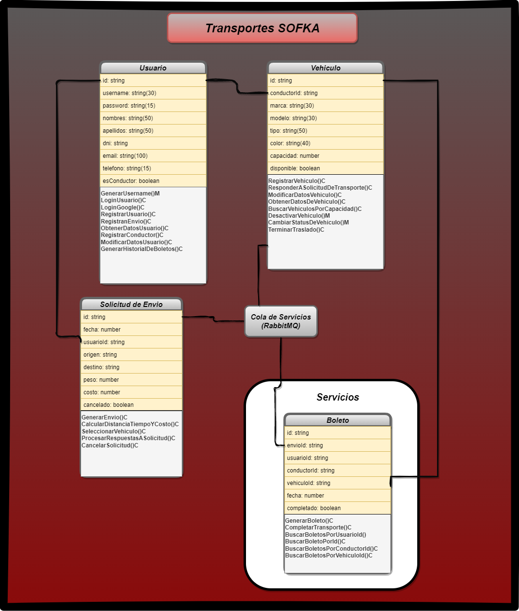

# Transporte SOFKA
## Modelo de Negocio

<hr>

## Tabla de Contenido
1. [Informacion General](#informacion-general)
2. [Requerimientos](#requerimientos)
3. [Instalacion](#instalacion)
4. [Tecnologias](#tecnologias)
5. [Estado](#estado)

-----------------------------------------------------------------------------------------------------------------------------------------------------------------------
### Informacion General

Este Proyecto es una aplicación web para recoger y entregar mercancías, donde los conductores y los clientes se registran y solicitan servicios según la disponibilidad de vehículos y conductores. Los conductores deben proporcionar sus datos personales y registrar un vehículo con su información correspondiente. La plataforma calcula el costo y el tiempo del servicio según la distancia y el peso del paquete, y el conductor acepta o rechaza la solicitud del cliente. La aplicación utiliza programación reactiva y funcional, una arquitectura adecuada y metodologías ágiles SCRUM para su desarrollo

-----------------------------------------------------------------------------------------------------------------------------------------------------------------------

### Requerimientos

1. Implementar protocolo AMQP ( rabbitMQ )
2. Implementar una base de datos relacional y una no relacional
3. Se debe tener un frontend con Angular
4. Autenticación con firebase
5. Clean code, SOLID.
6. git hub → ramas: main, develop, y una para cada Desarrollador y QA

## Backend 🖥️
1. Arquitectura limpia
2. Pruebas unitarias
3. Base de datos no relacional: MongoDB
4. Despliegue en Railway

## Frontend 🖥️
1. Angular
2. Diseño ( bootstrap, css, tailwind, etc )
3. Priorizar la experiencia de usuario
4. Despliegue en Firebase

## Agile 👤
1. Utilizar Trello para aplicar los conceptos
2. Generación de historias de usuario
3. Nombre del equipo
4. Selección de un líder


------------------------------------------------------------------------------------------------------------------------
### Instalacion ⚠️
# Backend 👤
1. Clonar el repositorio:
```
git clone https://github.com/migueltorresd/transporte-sofka_back
```
2.  Ejecutar los siguientes comandos:
```
npm install
```

# Frontend 🖥️

1. Clonar el repositorio:
```
git clone https://github.com/migueltorresd/transporte-sofka_front
```
2.  Ejecutar los siguientes comandos:
```
npm install
```

------------------------------------------------------------------------------------------------------------------------
# Tecnologias

El Proyecto fue desarrollado usando.

    - Backend: NestJs. ⚔️
    - Frontend: Angular. 🖥️
    - Bases de datos: MongoDB. 💾

------------------------------------------------------------------------------------------------------------------------
# Modelo UML



------------------------------------------------------------------------------------------------------------------------
